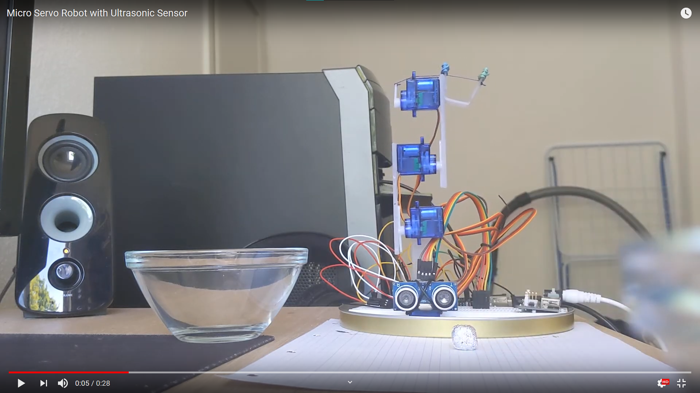

# servo-robot-ultrasonic

## Introduction
This is an Arduino based micro servo robotic arm with an ultrasonic sensor. This project was inspired by the verious DIY robotic arm projects found on YouTube, GitHub and the Arduino ProjectHub. I wanted to build a similar robot using mostly household items, without the need of a 3D printer.

## Code and Recources
- Environment: Arduino IDE, Visual Studio Code -> PlatformIO
- Libraries: Servo, NewPing

## Build
The board used is an Arduino Uno, but this project could also be controlled by a Nano. The arm has three degrees of freedom and contains four servos. Three of them control the joints 'base', 'elbow' and 'wrist', while the fourth one controls the 'gripper'. I used an external power supply, just to be on the safe side and not accidentally fry my board.

## Flow
The arm scans its surroundings in a loop by rotating along its vertical axis. If an object within a set distance is found, the arm positions itself accordingly, picks up the object, transports it to a predetermined position, and resumes to scan its environment. Below is a link to a YouTube video demonstating the movement (make sure to open the link in a new tab):

## Circuit
Pin Name | Pin Used
------------ | -------------
servo_base | ~6
servo_elbow | ~9
servo_wrist | ~10
servo_gripper | ~11
sensor_Trig | 2
sensor_Echo | ~3
